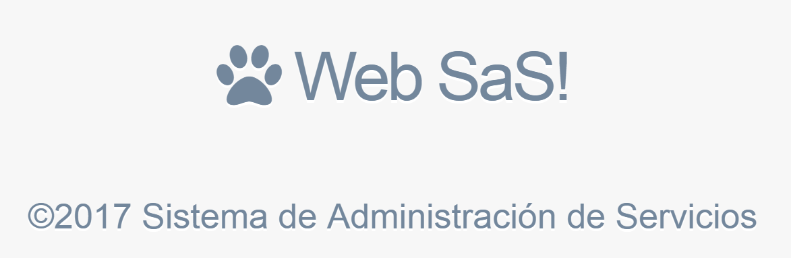
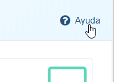

¡Bienvenido a la documentación de WebSAS!
=========================================

Esta guía de usuario contiene información sobre cómo realizar tareas esenciales en el sistema.
Si necesita ayuda adicional en alguna pantalla, busque el icono de ayuda en la esquina superior derecha del área principal.

   .. note::
    Los menúes y capturas de pantalla presentados en estos tutoriales pueden variar levemente en las nuevas versiones.

-----------

.. toctree::
    :maxdepth: 1
    :numbered:
    :glob:
    :caption: Contenido:

    howto/login
    howto/tiposervicio_crear
    howto/rubro_crear
    howto/tipotarea_crud
    howto/tipotarea_tarifar
    howto/gestion_empleados
    howto/asignar_usuario
    howto/gestionar_permisos
    howto/gestion_productos
    howto/cliente_crear
    howto/cliente_crud
    howto/equipo_crud
    howto/orden_nueva
    howto/tarea_crear
    howto/tarea_modificar_precio
    howto/tarea_aceptar
    howto/reserva_crear
    howto/tarea_cancelar
    howto/tarea_observar
    howto/tarea_finalizar
    howto/orden_cerrar
    howto/orden_cancelar
    howto/listados
    howto/reportes
