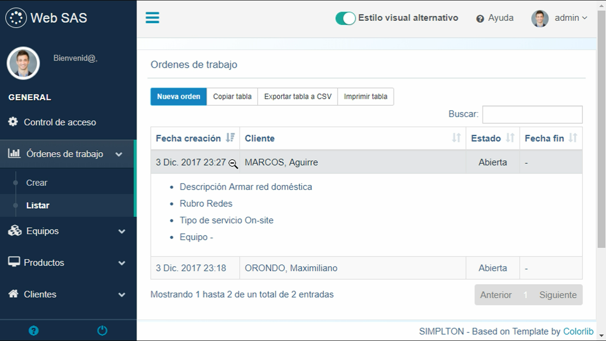

Gestión de Órdenes de trabajo
=============================

La pantalla de listado de órdenes de trabajo muestra una tabla que contiene
todas las órdenes de trabajo abiertas, cerradas o canceladas.

.. image:: img/ordenes.png
    :align: center

Las columnas de las tabla son las siguientes:

- Fecha de creación
    Fecha y hora en que se creó la orden de trabajo.
- Cliente
    Nombre del cliente titular de la orden de trabajo.
- Descripción
    Descripción del problema cargada al momento de abrir la orden de trabajo.
    Por cuestiones de espacio, sólo se muestra la primera parte de la descripción en la tabla.
- Rubro
    Rubro al que pertenece la orden de trabajo.
- Tipo de servicio
    Tipo de servicio asociado a la orden de trabajo.
- Equipo
    Descripción del equipo asociado a la orden de trabajo.
- Fecha fin
    Fecha y hora en que se cerró o canceló la orden de trabajo.

Puede ordenar las órdenes de trabajo como deseé haciendo click en la columna
correspondiente.

Tenga en cuenta que si la resolución horizontal de su dispositivo no permite visualizar
a lo ancho todas las columnas, algunas se ocultarán para mantener la estructura
de la tabla. Toque o haga click sobre la primera celda para desplegar
los datos no visibles hacia abajo.

