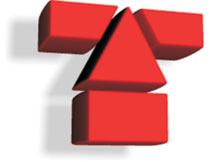

Introducción
============

WebSAS es el sistema de gestión de servicios de `AT-Informática <http://at-informatica.com.ar>`_, pensado principalmente
como una plataforma Web para uso interno. No obstante, podría ser extendido para que
los clientes realicen seguimiento de los servicios que han contratado de la empresa.

.. image:: imagenes/AT-titulo.gif
    :align: center

.. todo::
    Orientar esta introducción - quizás agregar algo de info sobre el proyecto en esta introducción y dejar el funcionamiento para websas.rst, y la parte técnica para desarrollo.rst